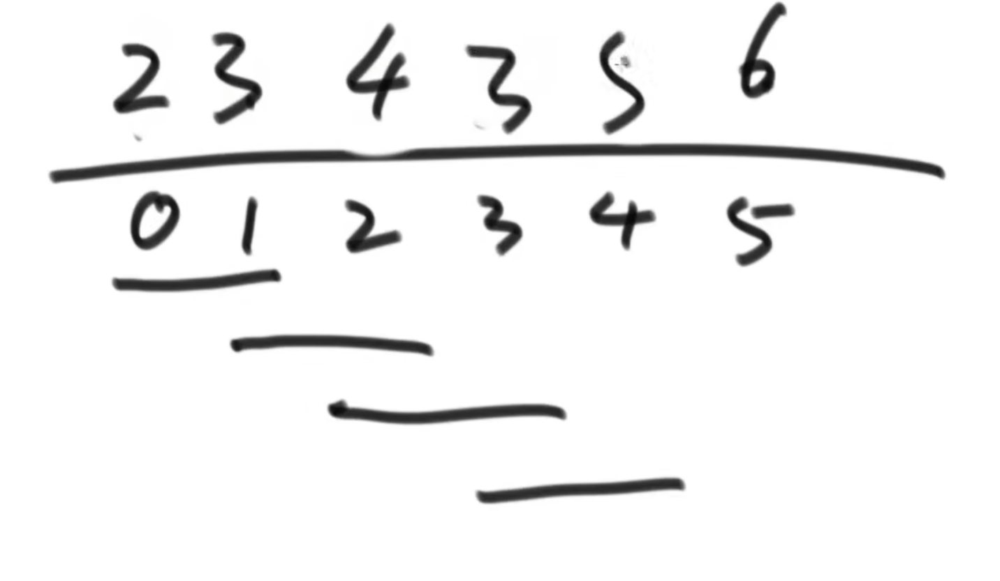
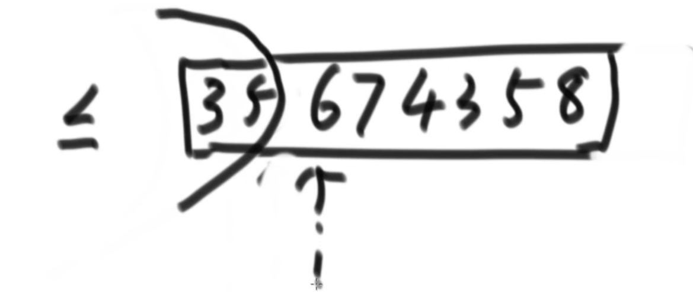
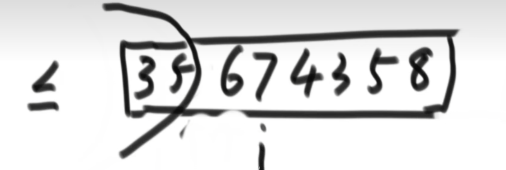
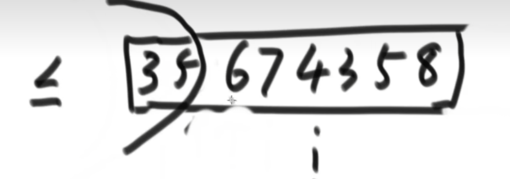
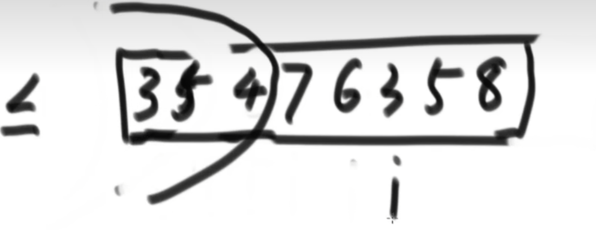
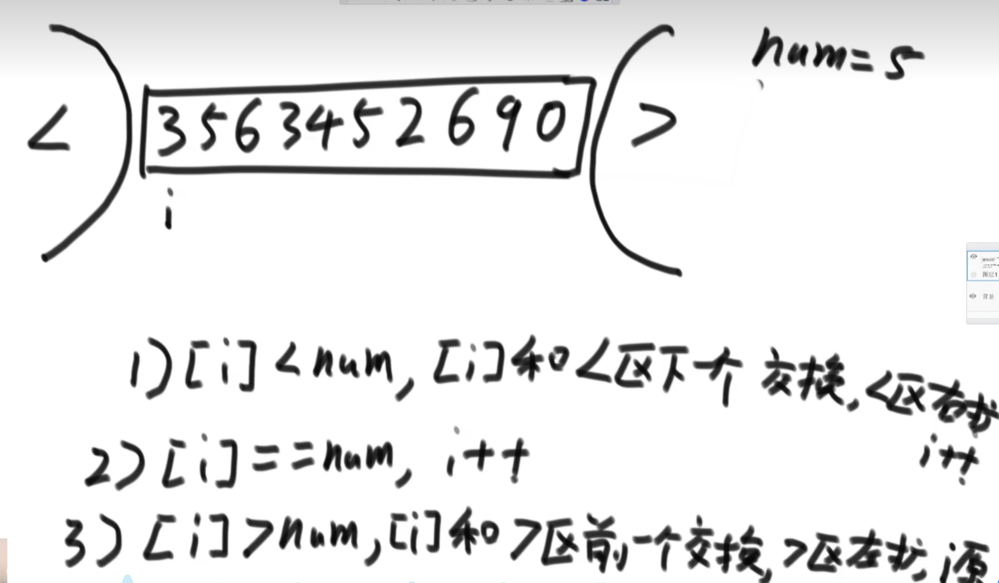
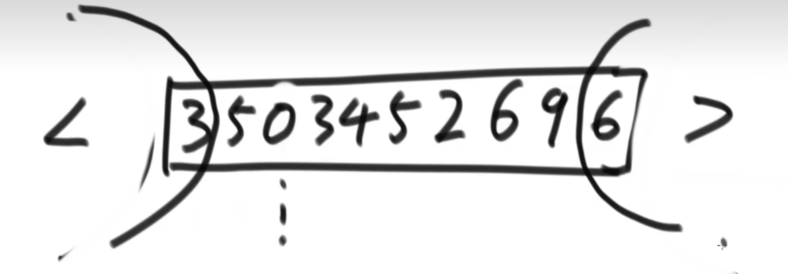
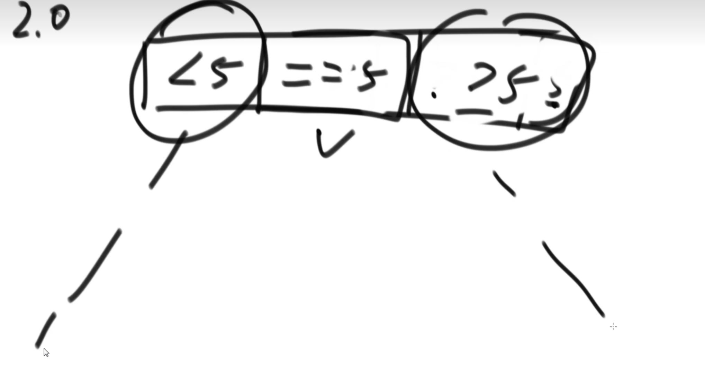
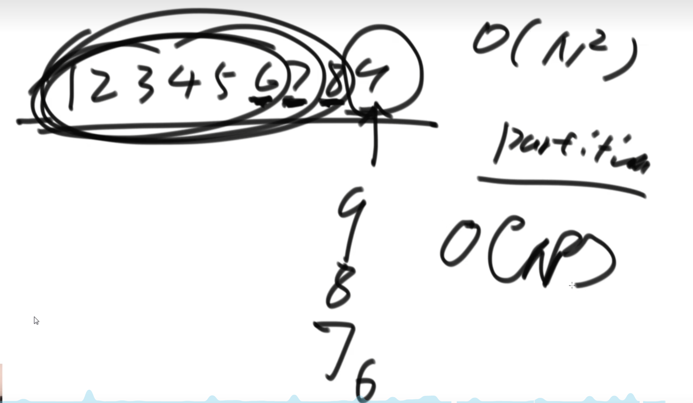
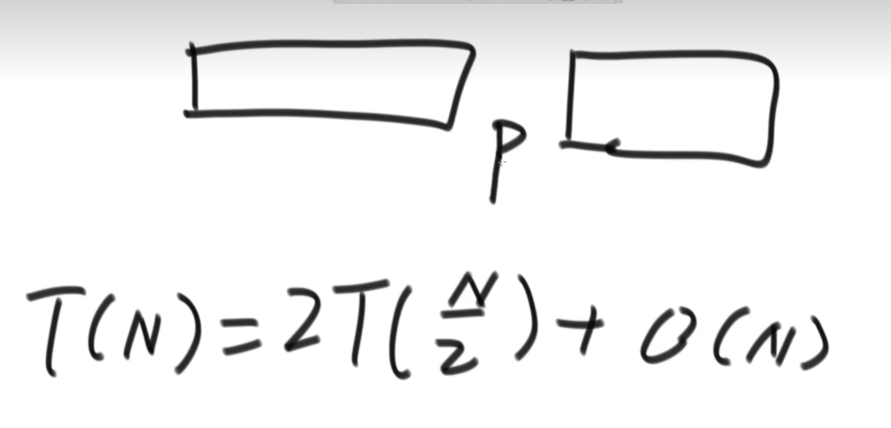

# Leetcode算法讲解

# 排序算法


## 1、冒泡排序



* 如上图，0和1位置上的数字，谁大谁往后移动。
* 然后，1和2上的位置数字，谁大谁往后移

>一直到第一次循环结束后，位置5上的数已经排序好了。

* 接下来继续从0~1, 1~2 ... 3~4重复，这样位置4上的数也排好了

时间复杂度：O(N^2^)


* 冒泡排序算法如下：

```c++
void bubbleSort(int[] arr)
{
	for(int e = arr.length-1; e>0; e--){ //外部从0~1 ... 1~2....
		for(int i =0;i<e;i++){
			if(arr[i]>arr[i+1]){
				swap(arr,i,i+1);
			}
		}
	}

}
```


## 2、选择排序

* 遍历，比较后把最小值放在最前边

* SelectSort algorithm code:

* 时间复杂度：O(N^2)

```c++
void SelectSort(int[] arr){
	for(int i =0;i<arr.length,i++) {//i~n-1
		int minIndex = i;
		for(int j = i+1;j<arr.length;j++) {//i~n-1上找最小值的下标
			minIndex = arr[j] < arr[minIndex] ? j:minIndex;
		}
		swap(arr,i,minIndex);
	}
}
```


## 3、插入排序：


* 在0位置上，已经有序
* 在0~1位置上，并未有序，交换 2 与 3 
* 在0~2位置上，已经有序
* 在0~3位置上，显然4小于5，交换，此时有：2,3,4,5,2,3,3，此时来到了4这个位置，已经有序


* 在0~4位置上，2与5换完，与4换完，与3换完，有了0 ~ 4 上有序
* ......

>插入排序最坏时间复杂度：O(N^2) 最坏时间复杂度： O(N)
>
>取最坏时间复杂度O(N^2)


* 最坏情况下：


显然是一个等差数列，时间复杂度为O(N^2)

* 代码如下：

```c++
void insertionSort(int[] arr){
	if(arr ==null || arr.length < 2){
		return;
	}
	// 0 ~ 0 有序
	// 0 ~ i 要有序 
	for(int i = 1 ; i < arr.length; i++){
		// 0 已经有序了，所以让i从1开始 让0 ~ i 做到有序
		for(int j = i -1 ; j >=0 && arr[j] > arr[j+1];j--){
			swap(arr,j,j+1); //前面的数大于后面的数,交换 
		}
	}
} 

```


## 4、二分法：

>二分法的详解与扩展
>1)在一个有序数组中，找某个数是否存在
>2)在一个有序数组中，找>=某个数最左侧的位置
>3)局部最小值问题 --> 不是只有有序才可以二分！

### 1)在一个有序数组中，找某个数是否存在:


### 2)在一个有序数组中，找>=某个数最左侧的位置


### 3)局部最小值问题

（**不需要有序也可以二分**）

>arr[]数组 无序 且 相邻的数一定不相等
>
>在一个范围内，求局部最小


例如下图：


1、

* 如果在 0 位置上，是局部最小，直接返回
* 如果 0 位置 不是局部最小，则 0位置的数 > 1位置的数 ， 有向下的趋势
* 在看N-1位置同理，这里N-1位置 道 N-2位置也是向下趋势

>得出结论，0~N-1范围上 必然存在局部最小 (两个向下趋势的线连接一定有一个拐点)


2、取位置中点M


* 如果 M位置上的数 是 **局部最小** ，那么直接返回M位置
* 如果不是，看M-1 M M+1 位置上的数
* 不妨设 M > M-1 则有：


>即：二分后，此位置是局部最小，就返回此位置
>
>如果不是局部最小，继续二分下去，直到找到局部最小

* 注意：前提条件为：arr[]数组 无序 且 **相邻的数一定不相等**


## 5、归并排序（Merge）


* 对左边，对右边进行归并排序过程

**以下是Merge的全过程例子：**

* 左侧设置一个指针，右侧也设置一个指针


* 如果 左侧 的 小于 右侧 ，先拷贝左侧的数，反之拷贝右侧的数
* 例如：1 小 --> 拷贝1 ， 同时左侧指针往后走一位


* 2 与 2 比较，相等，优先拷贝左侧


* 接下来同理，那一侧拷贝完了越界，直接将另一部分拷贝下来即可


* **在辅助空间中有序后，再拷贝回原数组**


**代码如下：**

```c++
void process(int[] arr,int L ,int R){
	if(L == R){
		return ;
	}
	int mid  = L + ((R-L) >> 1); 
	process(arr, L, mid); //让左侧有序 
	process(arr, mid + 1, R); //让右侧有序 
	
	merge(arr,L,mid,R);
} 
```

```C++
void merge(int[] arr,int L,int M,int R){
	int[] help = new int[R-L+1]; //辅助空间
	int i = 0;
	int p1 = L;
	int p2 = M + 1; 
	
	
	while (p1 <= M && p2 <= R){
		help[i++] = arr[p1] <= arr[p2] ? arr[p1++] : arr[p2++];
	}
	while(p1<= M){	//如果P1没越界 
		help[i++] = arr[p1++]; //把剩下的直接拷贝进辅助空间 
	}
	while(p2<= R){	//如果P2没越界 
		help[i++] = arr[p2++];
	}
	for(i = 0; i<help.length;i++){
		arr[L + i] = help[i]; //arr[l + i]是因为，有可能是截取原数组一部分进入merge 
	}
```


其中代码解释：

```c++
void process(int[] arr,int L ,int R){
	if(L == R){
		return ;
	}
	int mid  = L + ((R-L) >> 1); 
	process(arr, L, mid); //让左侧有序 
	process(arr, mid + 1, R); //让右侧有序 
    
    merge(arr,L,mid,R);
```

* 为什么process过程可以让左右侧分别有序？

1、进入PROCESS函数中，先对左侧L~MID 区域进行PROCESS过程，一直不断地向下走，直到最后一个出现了 条件：`if(L == R)` ， 此时 位于栈顶的process函数 开始return，这个最底层的左侧process函数出栈了，进入了倒数第一个函数体中的第二个process()，也就是process(arr,mid+1,R)......每一个递归中都有一个merge函数进行排序,数组中剩下一个数时， 天然有序，剩余两个数以上时，merge函数从底层随着process()函数一起，对划分的小区间内的数字进行排序，最终随着process递归回溯到最上层，merge也一同排序，最终完成的左右侧分别有序。

2、例子如下：

```c++
// 假设process一路递归到process(0,2);

process(arr,0,2): //以下是在此函数体中
	mid = 1;
	再进入函数体process(arr,0,1);	
		// R = mid = 1 以下是在(0,1)中，这里L = 0 , R = 1
		mid = 0;
			再进入函数体process(arr,0,0)中
				满足条件 L == R return ,跳出函数体 
		return 到这个区域 ，此时mid = 0;//
			再进入process(arr,mid+1,R)中，也就是process(arr,1,1);
			//注意，这里我处于函数体process(arr,0,1)中，这里 R = 1；
				发现满足条件 L == R return 
		return 到这个区域,接着执行merge1(arr,L,mid,R); 
		//此时L=0 M = 0 R = 1;
		//merge排序后对数组中[0~1]排好序,例如下图：
		
		//在merge结束后，函数体process(arr,0,1)就结束了，也就是process(arr,0,2)下的第一个process函数结束，此时运行函数体process(arr,2,2)，因为范围是(mid+1,R) ,mid =1 , R =2 也就是 (2,2)  这是第二个process函数,过程同上。
		但是因为此时 L = R ，所以return 在函数体process(arr,0,2)下执行merge1(arr,0,1,2);

// 当process(arr,2,2)也结束后,整个递归的Process(arr,0,2)也会像他下面的两个process函数体一样，继续为他的上级process服务，一路向上回溯。
```


```c++
void merge(int[] arr,int L,int M,int R){
	int[] help = new int[R-L+1]; //辅助空间
	int i = 0;
	int p1 = L;
	int p2 = M + 1; 
  
```


```c++
while (p1 <= M && p2 <= R){
		help[i++] = arr[p1] <= arr[p2] ? arr[p1++] : arr[p2++];
```


* C++型可运行代码如下：

```C++
#include <iostream>

void merge1(int* arr, int L, int M, int R);

void process(int* arr, int L, int R);

int main() {
    int arr[7] = {1, 4, 6, 5, 2, 8, 7};
    process(arr, 0, 6);
    for (int i = 0; i < 7; i++) {
        std::cout << arr[i] << " ";
    }
    return 0;
}

void merge1(int* arr, int L, int M, int R) {
    int len = R - L + 1;
    int* help = new int[len];
    int i = 0;
    int p1 = L;
    int p2 = M + 1;

    while (p1 <= M && p2 <= R) {
        help[i++] = arr[p1] <= arr[p2]? arr[p1++] : arr[p2++];
    }
    while (p1 <= M) {
        help[i++] = arr[p1++];
    }
    while (p2 <= R) {
        help[i++] = arr[p2++];
    }
    for (i = 0; i < len; i++) {
        arr[L + i] = help[i];
    }
    delete[] help;
}

void process(int* arr, int L, int R) {
    if (L == R) {
        return;
    } 
    int mid = L + ((R - L) >> 1);
    process(arr, L, mid);
    process(arr, mid + 1, R);
    merge1(arr, L, mid, R);
}
```


### merge的时间复杂度master公式分析：

process中调用了两个子问题，则  a = 2 , 在merge1函数中，两个指针一直往右走，拷贝进入辅助空间，为O(N) ,然后在把辅助空间的拷贝到原数组中，为O(N)，即merge1函数的时间复杂度为：O(N);

* 则：T(N) = 2T(N/2) + O(N)
* 其中，a = 2 , b = 2 , d = 1; 有：log~b~a = d
* **则归并排序的时间复杂度为：O(N * logN)** 空间复杂度为O(N)


### 归并排序拓展例题：

#### 1、小和问题：

>小和问题
>在一个数组中，每一个数左边比当前数小的数累加起来，叫做这个数组的小和。
>
>例子: **[1,3,4,2,5]** 1左边比1小的数，没有;3左边比3小的数，**1**  ;4左边比4小的数，**1、3**  ;2左边比2小的数 **1**  ;5左边比5小的数，**1、3、4、2 ** ;所以**小和为1+1+3+1+1+3+4+2=16**

* 暴力解法：在i位置上向左遍历，时间复杂度为：O(N^2^)


* 改写merge算法，使得小和问题时间复杂度为：O(N*logN)

* 以下是具体解法的详细分析：

>求一个数 左边 有多少数 比他本身小，可以转变为：
>
>一个数，它的右边有多少数，比他自身大。
>
>因为 小和 最后是要累加起来的，因此倒过来看顺序不影响结果。
>
>例如：[1,3,4,2,5]
>
>对于1来说，右边有4个比1大的数，所以这一步是 4 个 1；
>
>对于3来说，右边有2个比3大的数，所以是 2 个 3；
>
>对于4来说，右边有1个比4大的数，所以是1 个 4；
>
>对于2 来说，右边有1个比2大的数，所以是1 个 2；
>
>对于5来说，没有。
>
>小和 = 4x1 + 2x3 + 1x4 + 1x2 = 16


* 现在从归并排序底层来看：


>在左侧区间的最底层，1 与 3 比较，显然 1 的右边有 1 个 大的数，所以此时有**1个1**，这代表着，在【1,3】这个范围上，找到了一个数比1大 ，接着就是归并排序的常规操作

* 接下来是【1,3,4】的排序

>现在左侧是【1,3】右侧是【4】，在拷贝下去的时候，产生了**一个 1 ，一个 3；**
>
>然后排序进入辅助空间


* 然后对大右侧的[2,5]进行排序

>显然产生**一个 2** 

* 此时是【1,3,4】与【2,5】排序


>通过下标计算时，有**两个1**
>
>然后指针指向左侧的 3 和 右侧的2 不产生小和
>
>右侧 5 大 ，产生**一个3**
>
>同理，又产生**一个 4**
>
>此时数组也排好序了[1,2,3,4,5]

* 综合上面所有求出的小和相加：1+1+3+2+1+1+3+4 = 16

```c++
对于【1,3,4,2,5】中，1寻求小和的过程，是没有对一片区域重复进行检索的，因为检索完自己的区间后（左和右），就合并为一个大区间，去和另外一个大区间检索，不会重复检索
```


* 与merge排序细节上的不同

```
在拷贝到辅助空间时，小的依然优先拷贝，相等的必须优先拷贝右区间
```

例如：


>两侧都是 1 的时候，必须先把右侧的 1 1 1拷贝进入辅助空间，然后右区间的指针移动到 2 的时候，显然后面的数 都比1大。有五个1的小和
>
>这个时候 【左区间】 的指针才往下走，来到【左区间】的第二个1，显然这个 1 也有 五个1的小和 ，往下走，【左区间】的第三个1，也有 五个1的小和，第四个同理。


##### 小和问题代码：

```c++
int process(int[] arr,int l,int r){
	if(l==r){
		return 0;
	}
	int mid  = l + ((r-l)>>1);
	return process(arr,l,mid) + process(arr,mid+1,r) + merge(arr,1,mid,r);

}  
```

```C++
int merge(int[] arr,int L ,int m , int r){
	int[] help = new int[r-L+1];
	int i = 0;
	int p1 = L;
	int p2 = m+1;
	int res = 0;
	while(p1 <= m && p2<=r){
		res+= arr[p1]<arr[p2]? (r-p2+1) * arr[p1] : 0;
		help[i++] = arr[p1] < arr[p2] ? arr[p1++] : arr[p2++];
	}
	while(p1<=m){
		help[i++] = arr[p2++];
	}
	while(p2<=r){
		help[i++] = arr[p2++];
	}
	for(i=0;i<help.length;i++){
		arr[L+i] = help[i];
	}
	return res;
	}
```


* 以下是对代码的解释

```
while(p1 <= m && p2<=r){
		res+= arr[p1]<arr[p2]? (r-p2+1) * arr[p1] : 0;
		help[i++] = arr[p1] < arr[p2] ? arr[p1++] : arr[p2++];
	}
```

```c++
//在都不越界的情况下，p1指向的数 < p2指向的数时，(r-p2+1) 是包括p2以及后面的数 再用它乘以arr[p1]，也就是我这个小和的数，就是我这个数的小和在这个区间对比的小和量
//反之小和不增加
```


```c++
help[i++] = arr[p1] < arr[p2] ? arr[p1++] : arr[p2++];

//这里严格遵循 左边 < 右边 时，拷贝左边。
```


```c++
	while(p1<=m){
		help[i++] = arr[p2++];
	}
	while(p2<=r){
		help[i++] = arr[p2++];
	}
	for(i=0;i<help.length;i++){
		arr[L+i] = help[i];
	}
	return res;
	
	
//越界不产生小和，拷贝回去也不产生小和，最后返回小和的总数（当前区间）
```


## 6、快速排序

>情景1：
>
>给定一个数组arr，和一个数num，请把小于等于num的数放在数 组的左边，大于num的数放在数组的右边。
>注意，没有要求有序。
>要求额外空间复杂度0(1)，时间复杂度0(N)
>
>


* 首先对于这个数组，我们假想一个 **小于等于num** 的区域，从开头遍历数组，如果遍历的数 **小于等于** ， 那么就将这个数和 小于等于区域的下一个数交换，且**小于等于区向右扩**，继续遍历下一个数
* 例如：一开始遍历到3，满足区域条件，3与3自己交换，**区域向右扩**，跳转到5


* 5也同理



* 此时 6 大于num ，**此时遍历的指针 i 直接跳到下一位**




* 当指针遍历到4的时候，4 与 **小于等于区域** 下一个数 6 作交换




* 如图，小于等于区向右扩一位，且遍历指针往后走一位



* 此时遍历到3，满足小于等于区条件，此后均同理

* 最终结果如下：


>问题二(荷兰国旗问题)
>给定一个数组arr，和一个数num，请把小于num的数放在数组的左边，等于num的数放在数组的中间，大于num的数放在数组的 右边。
>要求额外空间复杂度0(1)，时间复杂度O(N)



* 对于**小于等于区** ，和情景1是相同的情况
* 对于等于的情况，直接使当前遍历指针 **i++**
* 对于大于的情况，将当前的数 与**大于区** 外的前一个数交换，大于区外扩，**但是当前指针 i不发生改变**

* 具体例子如下：


* 此时 6 是大于num的，则和**大于区域**的前一个数 0 交换，且大于区域左扩，**i 原地不动**



* 由此可以看出，**让i 原地不动** 是因为 0 是新过来的数，要再次进行比较
* 最终结果如下：


### 快速排序1.0：


* 将数组中的最后一个数作为要比较的num
* 这个数num 和 **大于区域** 的第一个数作交换，**这样使得小于等于区扩充，且使得小于等于区最后一个数是num**
* 接下来让左侧区域，和右侧区域重复这个行为，直到排序完成


* 例如：


* 如图，将num与6交换完之后，**5就固定在了两个区域之间了**
* 接下来在左区间内的最后一个数拿出来作num，重复此过程
* 在右区间内的最后一个数拿出来作num，重复此过程
* 最终可以完成有序


### 快速排序2.0：


* 让num与大于5区域的第一个数交换，就和等于5的区域靠在了一起


* 此时 等于5 的区域就不用动了，已经搞定了一批等于5 的区域
* 接着在小于5的区域上做递归，在大于5的区域上作递归



* 因为每一次递归搞定了一批等于划分值的数，因此总有有序的时候


#### 快速排序时间复杂度：

* 最差时间复杂度： O(N^2^)



* 如果是如上的情况，拿9作划分，只搞定了9这个区域，只有左侧的区域
* 在左侧的区域，拿8作划分，只搞定了一个8，没有右侧的区域，只有左侧的区域......
* 划分的过程即使patition，只是搞定了一个数，这是划分值打的很偏的情况

* 综合下来，这就是一个等差数列，**时间复杂度为O(N^2^)**


>**最好的情况**为：如果划分值打在恰当的位置，比如说打在了中间，则有：
>
>



* 在master公式中，T(N) = 2Y(N/2) + O(N) 

>这个O(N)是除了递归之外的时间复杂度，也即是patition的过程，为O(N)

* 根据master公式可以知道，此时的**时间复杂度为：O(N*logN)**


## 位运算拓展：

### 异或^

* a^a = 0 ,a ^ 0 = a

* 异或运算不需要看顺序，例如a ^ b ^ c ^ a ^b ^c ^c,相当于：a ^ a  ^  b ^ b ^ c ^ c ^ c
* 异或运算可以用来检测数组中出现奇数次的数和偶数次的数


>上图是二进制位的三个空间，abc异或，例如第一位中是 1 ^ 1 ^0 只要有奇数个1，那么异或的结果就是1，有偶数个1，异或的结果就是0，
>
>由此可知，异或的结果与顺序是无关的
>


### 在异或中的swap交换

* 有如下代码：

```c++
int a =10;
int b =29;

a = a ^ b;	
b = a ^ b;	// b = a ^ b ^ b == a , 即 b = a;
a = a ^ b;	// a = a ^ b ^ b == a ^ b ^ a == b

//至此完成了交换
```


### 异或例题：

>在int[] arr 中 
>
>(1)有一种数出现了奇数次，如何找到？
>
>（2）已知有两种数出现了奇数次，其他所有的数出现偶数次，如何找到这两种数?
>
>要求：时间复杂度O(N),空间复杂度O(1)；

​	

* （1）

```c++
int eor = 0;	//一个变量,把eor从头异或到尾

数组中的数[a.b.c....]
eor = eor ^ a;
eor = eor ^ b;
eor = eor ^ c;
......
// 把所有的数都在eor上异或，最后eor就是这个出现了奇数次的数

```

>原理是：eor是0，没有影响，而异或运算满足偶数为0，奇数不变，例如:
>
>[2,1,3,1,3,1,3,2,1],逐个异或有:[1111 22 333] -> 只剩下3

* （2）

```c++
// a,b 出现奇数次，others出现偶数次
int eor = 0;

让eor从头异或到尾，最后结果为eor = a ^ b;
//有：eor = a ^ b; 

因为 a b 是两种数，有a != b 且有 eor = a ^ b;
即：eor 在二进制中，一定有一位是不等于0的，即等于1(因为a和b这一位不相等)

//eor假设在第八位上不是0，是1 ,说明a,b 在第八位上不一样

准备一个变量eor',只让eor'异或上 第八位 不是 1 的数组中的数
因为 others出现偶数次，直接消去了，eor异或 第八位 不是 1 的数组中的数，即0 ^ 某一个数，而这个数只能是 a 或者 b 
//则有：eor' = a OR b;
    
此时我们得到 a 或者 b 其中一个数，假如我们得到的是a ,那么要得到b, 只需要：
	b' = eor ^ eor'
//因为eor = a ^ b , eor' = a , 现在有：a ^ b ^ a --> b' = b;
```

* 代码如下：

```c++
void printOddTimeSNum2(int[] arr){
	int eor = 0;
	for (int i =0; i< arr.length;i++){
		eor ^= arr[i];
} 
	//即是 eor = a ^ b
	//eor != 0
	//eor上必然有一个位置是1
	
	//这里用 原码 & 反码+1 == 可以取得最右边的那个二进制1 
	int rightOne = eor & (~eor + 1) //提取出二进制位最右边的1 


	int OnlyOne = 0; //eor' 
	for(int cur:arr){
		if((cur & rightOne) == 0) { //在rightOne上那一位唯一的1,cur是0 
			OnlyOne^=cur;	//只让eor'异或上 第x位 不是 1 的数组中的数 
			//此时OnlyOne = a 或者 b 
		}
	}
	int b2 = OnlyOne & eor ;
	
	cout<<"a="<<OnlyOne<<endl;
	cout<<"b="<<b2;
}
```


## 递归行为与递归时间复杂度的分析

>例如：用递归方法找到一个数组中的最大值

递归过程：


* 整个过程就是一个 进栈 的过程
* P(0,5)调用，进栈 ； p(0,2) 与 p(3,5)进栈 ......
* 例如：P(0,0)与P(1,1)得到结果，返回到P(0,1),出栈......以此类推

>即：利用栈来了一个后续遍历


### master公式及例子讲解

>
>
>利用master公式求解的题目，其子问题必须是子问题规模（等量）

* 问题模型如下：


* T(N) 是 母问题规模
* T(N/B) 是 **子问题规模（等量）** , a 是调用子问题的次数
* O(N^d) 是 除去调用子问题过程外 其余的时间复杂度

 

* 例如：使用递归求数组中的最大值：

```c++
//arr[L..R]范围上求最大值 N 
int process(int[] arr,int L ,int R){
	if(L == R){// arr[L..R]范围上只有一个数，直接返回，base case 
		return arr[L];
	}
	int mid  = L + ((R-L) >> 1); //取中点时放置数字过大溢出 
	int leftMax = process(arr,L,mid);
	int rightMax = process(arr,mid,R);
	
	return Math.max(leftMax,rightMax);
} 

```

* 这里的`int leftMax = process(arr,L,mid);`是一个子问题规模，`int rightMax = process(arr,mid,R);` 也是一个子问题规模。

* 除了子问题之外，取中点和返回函数都是决策过程，时间复杂度为O(1)
* master公式为：


#### 对于master公式的其他例子：

1、例如，在[L..R]范围上选择**右侧三分之二**大小 跑一个递归，再从**左侧三分之二大小**，跑一个递归，求最大值。


>
>
>虽然中间有重复过程，但最后只需比较各自区域中的MAX即可,且是同规模的子问题，符合master公式

**有：T(N) = 2 * T(N / 3/2) + O(1)**


2、亦或者将区域分为3 个 1/3 区域，依然符合master公式


3、**如果子问题规模不同，则不符合master公式，例如：**


### master公式直接得出时间复杂度


* 例如 a = 2 ，b = 2 ,d = 0 
* 则 log~b~a = 1 > d   满足第二个公式，**直接得出时间复杂度为：O(N)**

>以上例子说明 递归行为 的 时间复杂度为O(N) ,等效于 从左到右遍历一遍求最大值
>
>


